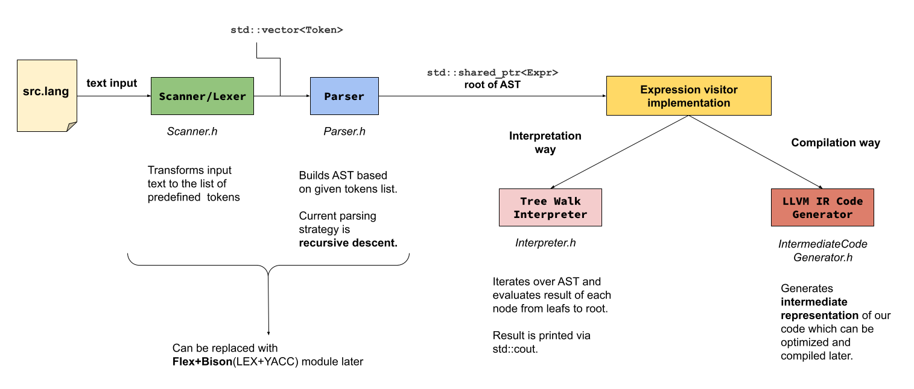

# Yare-Yare-Dawa
Tiny programming language for learning purpose. 

```cpp
    // Your first Yare-Yare-Dawa program!
    print "Hello, World!";
```

## Brief description

Yare-Yare-Dawa language supports:
- String, float, boolean data types
- Arithmetic, boolean expressions
- Input/output operators
- Variables, scope blocks
- Flow control (if statement and loops)
- Predefined and user-defined functions


For the full version check out [Language Description (WIP)](docs/language_description.md)

## High-level architecture of the project 



## Development Environment

### Platform Support And Requirements

**Yare-Yare-Dawa** has been tested on **Ubuntu 20.04** and **Ubuntu 22.04**. 

In order to build **Yare-Yare-Dawa** you will need:

* **LLVM 13** and **Clang 13**
* C++ compiler that supports **C++17**
* **CMake 3.21** or higher

### Installing Clang and LLVM On Ubuntu

```bash
  wget -O - 'https://apt.llvm.org/llvm-snapshot.gpg.key' | sudo apt-key add -
  sudo apt-add-repository "deb https://apt.llvm.org/focal/ llvm-toolchain-focal-13 main"
  sudo apt update
  sudo apt-get install -y llvm-13 llvm-13-dev llvm-13-tools clang-13
```

### Run Integration Tests Locally On Ubuntu

```bash
  cmake -Bbuild
  cmake --build build
  ./integration-tests/test_runner.sh
```

## Why Yare Yare Dawa?

I was developing this project during the war in Ukraine. Simultaneously, I had to work full-time, write my bachelor's thesis and pass several programming courses. So this phrase describes my emotions at the moments of tiring.

[Gimme A Damn Break](https://youtu.be/by3iQP2c3Qk)