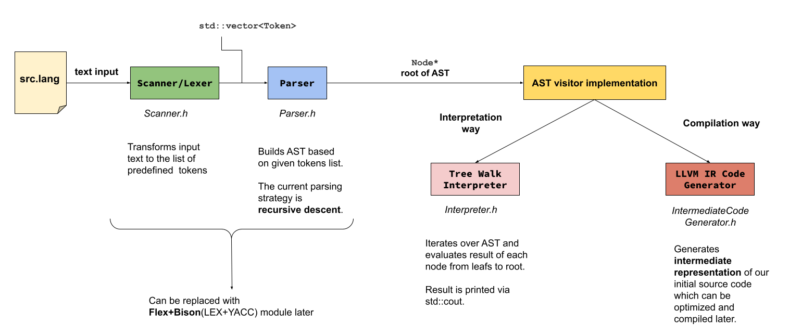

# Yare-Yare-Dawa
Tiny programming language for learning purpose. 

```cpp
    // Your first Yare-Yare-Dawa program!
    print "Hello, World!";
```

## [Language Description (WIP)](docs/language_description.md)

## High-level architecture of the project 



## Development Environment

### Platform Support And Requirements

**Yare-Yare-Dawa** has been tested on **Ubuntu 20.04** and **Ubuntu 22.04**. 

In order to build **Yare-Yare-Dawa** you will need:

* **LLVM 13** and **Clang 13**
* C++ compiler that supports **C++17**
* **CMake 3.21** or higher

### Installing Clang and LLVM On Ubuntu

```bash
  wget -O - 'https://apt.llvm.org/llvm-snapshot.gpg.key' | sudo apt-key add -
  sudo apt-add-repository "deb https://apt.llvm.org/focal/ llvm-toolchain-focal-13 main"
  sudo apt update
  sudo apt-get install -y llvm-13 llvm-13-dev llvm-13-tools clang-13
```
